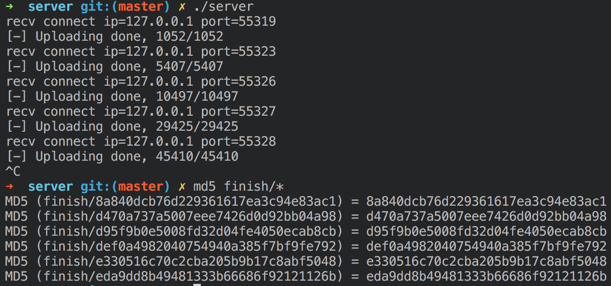

# FileUpload

## 需求

- 文件上传，保证正确性的同时尽量提高传输速度
- 适应各种网络环境，弱网（传输速率慢，丢包率高），网络切换（连接中断，IP变化）

## 目前初步解决方案

- 采用TCP协议保证传输的正确性
- 客户端断线自动重连，与服务器协商进行断点续传

## 客户端上传流程

1. 向服务器发送待传文件信息（大小，MD5哈希值）
2. 把文件按照一定大小（目前为1K）分为若干个块
3. 接受服务器返回的确认包，通过其内容决定是否进行断点续传，从第几（i）块开始续传
4. 发送第i个文件块的头信息（4字节标志信息+当前块ID）
5. 发送第i个文件块，若发送失败，返回第1步；若发送成功并且i小于文件总块数，i增加1，返回第4步；若发送成功并且i不小于文件总块数，结束传输。

## 缺点或可改进部分

- 可否用UDP替代TCP协议，以提高传输速度
- **固定的文件分块大小**可能导致**带宽较小又不稳定**用户一直无法传输成功一个文件块。

## 效果图

### 客户端上传

### 服务器接受及MD5校验
